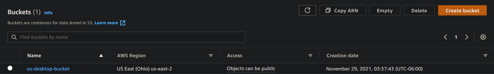
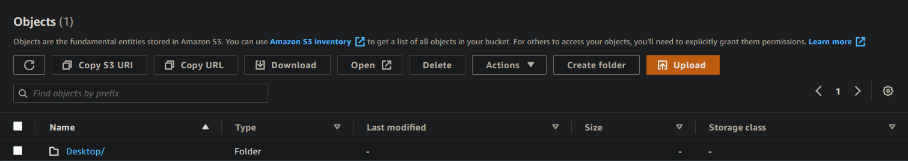
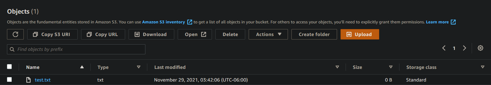

## (AWS-S3) File Handling With Python
Automate the handling of different files to automatically be uploaded to amazon S3.
In This Script; For Every File Ending In '.txt' On My Main Working DIR Is Uploaded To A Directory In S3 Named 'Desktop/', Then It Uploads The Files Ending In .txt From My Main Directory Into AWS S3-(Desktop/.)
The main purpose of this script is to make file handling easier and makes backing up files simpler.

## Getting Started
'NOT NEEDED' Download the "github_assets" folder to visualize how this script works!

 Creating IAM users:
* Create User.
* Enable Programmatic Access.
* Give User FullS3Access. (Desired Permission)
* Copy Access & Secret Access Keys.

## Visualization:

## Technologies Used:
* AWS - S3, IAM
* Python

Muhammad A. Ali
